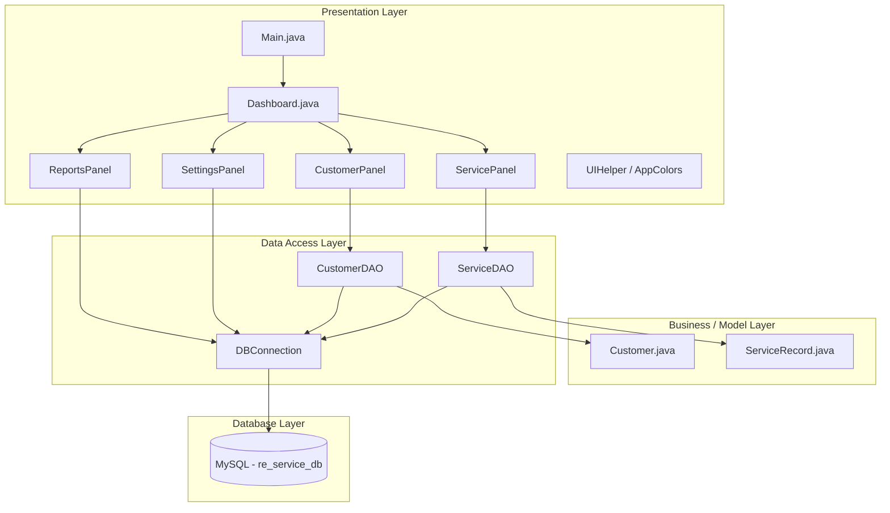
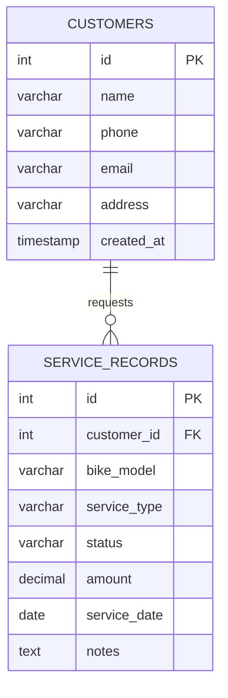
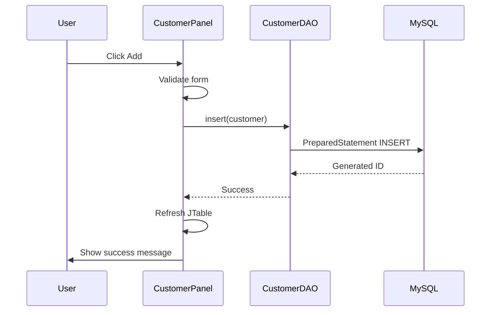

# ROYAL ENFIELD SERVICE MANAGEMENT SYSTEM

## Mini Project Report

---

| **Field** | **Details** |
|-----------|-------------|
| **Project Title** | Royal Enfield Service Management System |
| **Domain** | Desktop Application / Service Center Management |
| **Platform** | Java (JDK 17+), Java Swing, MySQL |
| **Architecture** | Layered Architecture (Presentation – Business – Data) |
| **Database** | MySQL 8.x (`re_service_db`) |

---

## Table of Contents

1. [Abstract](#1-abstract)
2. [Introduction](#2-introduction)
3. [Objectives](#3-objectives)
4. [Technologies Used](#4-technologies-used)
5. [System Architecture](#5-system-architecture)
6. [Database Design](#6-database-design)
7. [ER Diagram Explanation](#7-er-diagram-explanation)
8. [Table Descriptions](#8-table-descriptions)
9. [Primary Key and Foreign Key Explanation](#9-primary-key-and-foreign-key-explanation)
10. [Java Implementation Explanation](#10-java-implementation-explanation)
11. [JDBC Explanation](#11-jdbc-explanation)
12. [Swing UI Explanation](#12-swing-ui-explanation)
13. [CRUD Operations Explanation](#13-crud-operations-explanation)
14. [Screenshots Section](#14-screenshots-section)
15. [Advantages](#15-advantages)
16. [Future Enhancements](#16-future-enhancements)
17. [Conclusion](#17-conclusion)

---

## 1. Abstract

The **Royal Enfield Service Management System** is a desktop-based software application developed using **Java Swing** for the graphical user interface and **MySQL** for persistent data storage. The system is designed for Royal Enfield authorized service centers to manage customer information, bike service records, service status tracking, and revenue monitoring through a single integrated application.

The application provides a modern, dark-themed user interface inspired by premium fintech and admin dashboard designs, with Royal Enfield brand colors (matte black, charcoal gray, red accents, and orange highlights). It supports full **CRUD (Create, Read, Update, Delete)** operations on customers and service records, real-time dashboard statistics, search functionality, and configurable database connectivity through a properties file and in-app settings module.

The project demonstrates practical implementation of **JDBC** connectivity, **DAO (Data Access Object)** design pattern, layered architecture, and custom Swing UI styling without relying on default look-and-feel components. The system automates database and table creation on first run and includes sample data for demonstration and testing purposes.

---

## 2. Introduction

Royal Enfield is one of the most recognized motorcycle brands in India and worldwide. Authorized service centers handle a large volume of customers, periodic maintenance, repairs, and spare-part-related services. Traditionally, many small and medium service centers maintain records using paper registers or generic spreadsheet tools, which leads to:

- Difficulty in searching customer history
- Loss or duplication of service records
- No centralized view of active jobs and revenue
- Human errors in billing and status tracking

The **Royal Enfield Service Management System** addresses these problems by providing a dedicated desktop solution tailored to bike service workflows. The software allows staff to register customers, log service details (bike model, service type, status, amount, date), generate summary reports, and view dashboard analytics at a glance.

This mini project was developed as part of academic curriculum requirements to demonstrate proficiency in **Java programming**, **GUI development**, **relational database design**, and **database connectivity using JDBC**. The application runs on Windows (and other platforms supporting Java) and connects to a local MySQL server, making it suitable for college laboratory environments and real-world small business deployment.

---

## 3. Objectives

### 3.1 Primary Objectives

1. **Develop a user-friendly desktop application** for managing Royal Enfield service center operations.
2. **Design and implement a normalized MySQL database** to store customers and service records with referential integrity.
3. **Implement JDBC-based connectivity** between Java and MySQL for reliable data persistence.
4. **Provide complete CRUD operations** for both customers and service records.
5. **Build a modern graphical interface** using Java Swing with custom styling and intuitive navigation.

### 3.2 Secondary Objectives

1. Display **real-time dashboard statistics** (total customers, bikes serviced, active services, revenue).
2. Enable **search and filter** functionality in customer and service modules.
3. Support **configurable database settings** without recompiling the application.
4. Automate **database and table creation** for easy first-time setup.
5. Follow **clean code practices** with separation of UI, business logic, and data access layers.

### 3.3 Learning Outcomes

Upon completion of this project, the developer gains practical experience in:

- Object-oriented design in Java
- Event-driven GUI programming
- SQL schema design and relationships
- JDBC API usage with prepared statements
- Software documentation and project reporting

---

## 4. Technologies Used

| **Technology** | **Version / Details** | **Purpose** |
|----------------|----------------------|-------------|
| **Java** | JDK 17 or higher (tested on JDK 26) | Core programming language |
| **Java Swing** | Part of JDK (`javax.swing`) | Desktop GUI framework |
| **AWT** | Part of JDK (`java.awt`) | Graphics, layouts, custom painting |
| **MySQL** | 8.x | Relational database management system |
| **JDBC** | MySQL Connector/J 9.7.0 | Database connectivity driver |
| **SQL** | MySQL dialect | DDL and DML for schema and queries |
| **Properties File** | `db.properties` | External database configuration |

### 4.1 Development Tools

- **IDE / Editor:** Cursor / VS Code / any Java-capable IDE
- **Compiler:** `javac`
- **Runtime:** `java`
- **Database Client:** MySQL Workbench (optional)
- **Batch Scripts:** `run.bat`, `setup-db.bat` (Windows)

### 4.2 Design Patterns and Practices

- **Layered Architecture** — Presentation, Data Access, Database
- **DAO Pattern** — `CustomerDAO`, `ServiceDAO`
- **Singleton Connection** — `DBConnection` class
- **Model Classes** — `Customer`, `ServiceRecord`
- **Constants Class** — `AppColors` for theme consistency

---

## 5. System Architecture

The system follows a **three-tier layered architecture** where each layer has a distinct responsibility. This separation improves maintainability, testing, and future expansion.

### 5.1 Architecture Diagram



### 5.2 Layer Descriptions

| **Layer** | **Components** | **Responsibility** |
|-----------|----------------|-------------------|
| **Presentation** | `Main`, `Dashboard`, panels, `UIHelper` | User interaction, forms, tables, navigation |
| **Model** | `Customer`, `ServiceRecord` | Represent business entities as Java objects |
| **Data Access** | `CustomerDAO`, `ServiceDAO`, `DBConnection` | SQL execution, connection management |
| **Database** | MySQL tables | Persistent storage |

### 5.3 Application Flow

1. User launches `Main.java` → global theme applied → `DBConnection.initializeSchema()` runs.
2. `Dashboard` frame opens with sidebar navigation.
3. User selects a module (Customers, Services, etc.).
4. Panel loads data via DAO → results displayed in `JTable` or labels.
5. User performs Add/Update/Delete → DAO executes SQL → dashboard statistics refresh.

### 5.4 Project Directory Structure

```
gudi1/
├── lib/
│   └── mysql-connector-j-9.7.0.jar
├── src/com/royalenfield/service/
│   ├── Main.java
│   ├── Dashboard.java
│   ├── CustomerPanel.java
│   ├── ServicePanel.java
│   ├── ReportsPanel.java
│   ├── SettingsPanel.java
│   ├── UIHelper.java
│   ├── AppColors.java
│   ├── Customer.java / ServiceRecord.java
│   ├── CustomerDAO.java / ServiceDAO.java
│   ├── DBConnection.java
│   └── DbSetup.java
├── database.sql
├── db.properties
├── run.bat
├── setup-db.bat
└── README.md
```

---

## 6. Database Design

The database **`re_service_db`** is designed using relational database principles with two main entities: **Customers** and **Service Records**. The design is normalized to **Third Normal Form (3NF)** for the scope of this project:

- Each customer attribute is stored in one place (no repeating groups).
- Service details are stored in a separate table linked by `customer_id`.
- No transitive dependencies exist between non-key attributes.

### 6.1 Design Goals

- **Data integrity** through primary and foreign keys
- **Referential integrity** — deleting a customer removes linked services (CASCADE)
- **Scalability** — easy to add new tables (parts inventory, invoices) later
- **Query efficiency** — indexed primary keys on `id` columns

### 6.2 Entity Summary

| **Entity** | **Description** |
|------------|-----------------|
| **customers** | Stores personal and contact details of bike owners |
| **service_records** | Stores each service job linked to one customer |

---

## 7. ER Diagram Explanation

The **Entity-Relationship (ER) Diagram** represents the logical structure of data and relationships between entities.

### 7.1 ER Diagram



### 7.2 Relationship Explanation

- **Entity: CUSTOMERS** — Represents individuals who bring their Royal Enfield motorcycles for service.
- **Entity: SERVICE_RECORDS** — Represents a single service job (one row per visit/repair).
- **Relationship: One-to-Many (1:N)** — One customer can have **many** service records; each service record belongs to **exactly one** customer.
- **Cardinality:** `1` customer → `N` service records (optional on customer side: a new customer may have zero services initially).

### 7.3 Business Rules Reflected in ER Design

1. A service record **must** reference a valid customer (`customer_id` foreign key).
2. Customer **name** is mandatory (`NOT NULL`).
3. Service **status** defaults to `Pending` when not specified.
4. Deleting a customer **cascades** to delete all associated service records to avoid orphan rows.

---

## 8. Table Descriptions

### 8.1 Table: `customers`

Stores master data for all registered customers of the service center.

| **Column** | **Data Type** | **Constraints** | **Description** |
|------------|---------------|-----------------|-----------------|
| `id` | INT | PRIMARY KEY, AUTO_INCREMENT | Unique identifier for each customer |
| `name` | VARCHAR(120) | NOT NULL | Full name of the customer |
| `phone` | VARCHAR(20) | NULL allowed | Contact phone number |
| `email` | VARCHAR(120) | NULL allowed | Email address |
| `address` | VARCHAR(255) | NULL allowed | Residential or mailing address |
| `created_at` | TIMESTAMP | DEFAULT CURRENT_TIMESTAMP | Record creation date and time |

### 8.2 Table: `service_records`

Stores details of each bike service performed at the center.

| **Column** | **Data Type** | **Constraints** | **Description** |
|------------|---------------|-----------------|-----------------|
| `id` | INT | PRIMARY KEY, AUTO_INCREMENT | Unique service record ID |
| `customer_id` | INT | FOREIGN KEY → customers(id) | Links service to customer |
| `bike_model` | VARCHAR(80) | NULL allowed | Royal Enfield model (e.g., Classic 350) |
| `service_type` | VARCHAR(80) | NULL allowed | Type of service (General, Brake, etc.) |
| `status` | VARCHAR(40) | DEFAULT 'Pending' | Pending / In Progress / Completed / Cancelled |
| `amount` | DECIMAL(10,2) | DEFAULT 0 | Service charge in rupees |
| `service_date` | DATE | NULL allowed | Scheduled or completed date |
| `notes` | TEXT | NULL allowed | Additional remarks |

### 8.3 Sample Data (After Setup)

| **Customers** | **Phone** | **Bike (Sample Service)** |
|---------------|-----------|---------------------------|
| Arjun Mehta | 9876543210 | Classic 350 |
| Priya Sharma | 9123456780 | Hunter 350 |
| Rahul Verma | 9988776655 | Meteor 350 |

---

## 9. Primary Key and Foreign Key Explanation

### 9.1 Primary Key (PK)

A **primary key** uniquely identifies each row in a table. No two rows can have the same primary key value, and the key cannot be NULL.

| **Table** | **Primary Key** | **Implementation** |
|-----------|-----------------|-------------------|
| `customers` | `id` | `INT AUTO_INCREMENT PRIMARY KEY` |
| `service_records` | `id` | `INT AUTO_INCREMENT PRIMARY KEY` |

**Why AUTO_INCREMENT?**  
The database automatically generates the next integer ID (1, 2, 3, …) when a new row is inserted. This eliminates manual ID assignment errors and guarantees uniqueness.

**Example:**  
Customer "Arjun Mehta" is stored with `id = 1`. All future references to this customer in `service_records` use `customer_id = 1`.

### 9.2 Foreign Key (FK)

A **foreign key** is a column in one table that refers to the primary key of another table. It establishes a link between related data and enforces **referential integrity**.

| **Child Table** | **Foreign Key Column** | **Parent Table** | **Parent Key** |
|-----------------|------------------------|------------------|----------------|
| `service_records` | `customer_id` | `customers` | `id` |

**SQL Definition:**

```sql
CONSTRAINT fk_customer FOREIGN KEY (customer_id)
    REFERENCES customers(id) ON DELETE CASCADE
```

### 9.3 ON DELETE CASCADE

When a customer is deleted from the `customers` table, MySQL **automatically deletes** all `service_records` rows where `customer_id` matches that customer. This prevents:

- Orphan records (services pointing to non-existent customers)
- Manual cleanup of child rows

### 9.4 Referential Integrity Rules

| **Operation** | **Allowed?** | **Explanation** |
|---------------|--------------|-----------------|
| Insert service with valid `customer_id` | Yes | Customer must exist |
| Insert service with invalid `customer_id` | No | FK constraint violation |
| Delete customer with services | Yes | CASCADE removes services |
| Duplicate customer `id` | No | PK uniqueness enforced |

---

## 10. Java Implementation Explanation

The Java implementation is organized into **14 source files** under package `com.royalenfield.service`, each with a specific role.

### 10.1 Entry Point — `Main.java`

- Sets Swing look-and-feel defaults and global fonts via `UIManager`.
- Calls `DBConnection.initializeSchema()` to create database objects.
- Launches `Dashboard` on the **Event Dispatch Thread (EDT)** using `SwingUtilities.invokeLater()` for thread-safe GUI creation.

### 10.2 Main Window — `Dashboard.java`

- Extends `JFrame` — primary application window.
- Uses `BorderLayout`: sidebar (west), content area (center).
- Contains custom inner classes: `RoundedPanel`, `RoundedButton`, `StatCard`, `NavButton`.
- Manages navigation between Dashboard home, Customers, Services, Reports, and Settings.
- Refreshes statistics by calling `DBConnection` aggregate methods.

### 10.3 Model Classes

| **Class** | **Purpose** |
|-----------|-------------|
| `Customer.java` | POJO with id, name, phone, email, address + getters/setters |
| `ServiceRecord.java` | POJO with service fields including `LocalDate` for service date |

### 10.4 Data Access Objects

| **Class** | **Methods** |
|-----------|-------------|
| `CustomerDAO.java` | `findAll()`, `search()`, `insert()`, `update()`, `delete()` |
| `ServiceDAO.java` | `findAll()`, `insert()`, `update()`, `delete()` with JOIN for customer name |

### 10.5 Module Panels

| **Panel** | **Functionality** |
|-----------|-------------------|
| `CustomerPanel` | Customer table, search bar, form, Add/Update/Delete |
| `ServicePanel` | Service table, customer dropdown, status/amount/date fields |
| `ReportsPanel` | Summary labels + recent services table |
| `SettingsPanel` | DB host, port, credentials, test/save/init buttons |

### 10.6 Utility Classes

| **Class** | **Functionality** |
|-----------|-------------------|
| `AppColors.java` | Central color and font size constants (Royal Enfield theme) |
| `UIHelper.java` | Rounded text fields, styled tables, buttons, form rows |
| `DBConnection.java` | Connection pooling (single connection), config, schema, stats |
| `DbSetup.java` | Standalone utility to initialize database from command line |

### 10.7 Key Java Concepts Demonstrated

- **Encapsulation** — private fields with public accessors in model classes
- **Static utility methods** — DAO and DBConnection methods
- **Inner classes** — UI components inside `Dashboard`
- **Event listeners** — button clicks, table selection, document listeners for search
- **Exception handling** — `SQLException` caught and shown via `JOptionPane`

---

## 11. JDBC Explanation

**JDBC (Java Database Connectivity)** is a Java API that allows applications to connect to relational databases, execute SQL statements, and process results.

### 11.1 JDBC Architecture in This Project

```
Java Application  →  JDBC Driver (Connector/J)  →  MySQL Server
```

The **MySQL Connector/J** driver (`mysql-connector-j-9.7.0.jar`) implements JDBC interfaces and translates Java calls into MySQL protocol operations.

### 11.2 Connection Establishment

```java
Class.forName("com.mysql.cj.jdbc.Driver");
Connection conn = DriverManager.getConnection(jdbcUrl, user, password);
```

- **Driver loading** — Registers MySQL JDBC driver with `DriverManager`.
- **Connection URL** — `jdbc:mysql://localhost:3306/re_service_db?useSSL=false&serverTimezone=UTC`
- **Credentials** — Loaded from `db.properties` file.

### 11.3 JDBC Components Used

| **Interface / Class** | **Usage in Project** |
|-----------------------|----------------------|
| `Connection` | Single shared connection via `DBConnection.getConnection()` |
| `Statement` | Schema creation, aggregate COUNT/SUM queries |
| `PreparedStatement` | Parameterized INSERT, UPDATE, DELETE, SELECT (prevents SQL injection) |
| `ResultSet` | Iterating rows from SELECT queries |
| `DriverManager` | Obtaining database connections |

### 11.4 Prepared Statement Example

```java
String sql = "INSERT INTO customers (name, phone, email, address) VALUES (?, ?, ?, ?)";
PreparedStatement ps = connection.prepareStatement(sql);
ps.setString(1, customer.getName());
ps.setString(2, customer.getPhone());
ps.executeUpdate();
```

**Advantages of PreparedStatement:**

1. **Security** — Special characters in user input cannot alter SQL structure (SQL injection prevention).
2. **Performance** — Query plan can be cached by the database for repeated execution.
3. **Type safety** — `setInt()`, `setString()`, `setDate()` ensure correct data types.

### 11.5 Generated Keys

After INSERT, the application retrieves auto-generated IDs:

```java
prepareStatement(sql, Statement.RETURN_GENERATED_KEYS);
ResultSet keys = ps.getGeneratedKeys();
```

This allows newly created customer IDs to be used immediately when adding service records.

### 11.6 Configuration Management

Database settings are externalized in **`db.properties`**:

```properties
host=localhost
port=3306
database=re_service_db
user=root
password=********
```

This follows the principle of **separation of configuration from code**, allowing deployment on different machines without recompilation.

---

## 12. Swing UI Explanation

The user interface is built entirely using **Java Swing** (`javax.swing`) with **custom painting** to achieve a premium dark-mode appearance, avoiding the default gray Metal look.

### 12.1 Main Swing Components Used

| **Component** | **Usage** |
|---------------|-----------|
| `JFrame` | Main application window |
| `JPanel` | Layout containers, cards, sidebar |
| `JLabel` | Titles, statistics, form labels |
| `JButton` | Navigation, CRUD actions (custom rounded buttons) |
| `JTextField` | Input fields with rounded borders |
| `JComboBox` | Customer selection, service type, status |
| `JTable` | Display customer and service lists |
| `JScrollPane` | Scrollable table areas |
| `Timer` | Live clock and hover animations |

### 12.2 Layout Managers

| **Layout** | **Where Used** |
|------------|----------------|
| `BorderLayout` | Main window, dashboard sections |
| `BoxLayout` | Sidebar navigation (vertical stack) |
| `GridLayout` | Statistics cards (2×2 grid) |
| `FlowLayout` | Quick action buttons, toolbar |

### 12.3 Custom UI Features

1. **Royal Enfield Theme** — Colors defined in `AppColors.java` (matte black `#0E0E10`, red accent `#C41E3A`, orange `#E87E36`).
2. **Rounded Panels** — `Graphics2D.fillRoundRect()` with anti-aliasing for smooth corners.
3. **Rounded Buttons** — Custom `paintComponent()` with hover color animation via `javax.swing.Timer`.
4. **Modern Tables** — Dark background, alternating row colors, red selection highlight, styled header.
5. **Sidebar Navigation** — Icons (Unicode symbols) beside menu labels, active state highlighting.
6. **Live Date/Time** — Header clock updates every second.
7. **Typography** — Segoe UI font family with hierarchical sizes for headings and body text.

### 12.4 UI Module Layout

```
┌─────────────────────────────────────────────────────────────┐
│  [RE Logo]  ROYAL ENFIELD    │  Dashboard    [Date/Time]  │
│  Sidebar   │──────────────────────────────────────────────│
│  Dashboard │  Welcome Card / Statistics / Table / Form     │
│  Customers │                                               │
│  Services  │              Content Area                     │
│  Reports   │                                               │
│  Settings  │                                               │
│  [DB Status]│                                              │
└─────────────────────────────────────────────────────────────┘
```

### 12.5 Event-Driven Programming

Swing is **event-driven**: user actions (clicks, typing) trigger listeners that call methods to update the UI or database. Examples:

- **Search field** — `DocumentListener` reloads table on each keystroke.
- **Table row click** — `ListSelectionListener` fills the edit form.
- **Add button** — `ActionListener` calls DAO insert method.

All UI updates after database operations run on the EDT to prevent threading issues.

---

## 13. CRUD Operations Explanation

**CRUD** stands for **Create, Read, Update, Delete** — the four basic operations for persistent storage management.

### 13.1 Customer Module CRUD

| **Operation** | **User Action** | **SQL / Method** |
|---------------|-----------------|------------------|
| **Create** | Fill form → Click "Add" | `INSERT INTO customers ...` → `CustomerDAO.insert()` |
| **Read** | Open Customers module / Search | `SELECT ... WHERE name LIKE ?` → `CustomerDAO.search()` |
| **Update** | Select row → Edit → Click "Update" | `UPDATE customers SET ... WHERE id=?` → `CustomerDAO.update()` |
| **Delete** | Select row → Click "Delete" | `DELETE FROM customers WHERE id=?` → `CustomerDAO.delete()` |

### 13.2 Service Records Module CRUD

| **Operation** | **User Action** | **SQL / Method** |
|---------------|-----------------|------------------|
| **Create** | Select customer, fill details → "Add" | `INSERT INTO service_records ...` → `ServiceDAO.insert()` |
| **Read** | Open Services / Search | `SELECT ... JOIN customers` → `ServiceDAO.findAll()` |
| **Update** | Select row → Modify → "Update" | `UPDATE service_records SET ...` → `ServiceDAO.update()` |
| **Delete** | Select row → "Delete" | `DELETE FROM service_records WHERE id=?` → `ServiceDAO.delete()` |

### 13.3 Read Operations — Dashboard & Reports

| **Feature** | **SQL Type** | **Example** |
|-------------|--------------|-------------|
| Total customers | `SELECT COUNT(*) FROM customers` | Returns integer count |
| Active services | `SELECT COUNT(*) ... WHERE status IN (...)` | Filters by status |
| Total revenue | `SELECT SUM(amount) ... WHERE status='Completed'` | Aggregate function |
| Recent services | `SELECT ... ORDER BY service_date DESC` | Sorted list |

### 13.4 Validation Rules (Application Level)

- Customer **name** is required before insert/update.
- Service **bike model** is required.
- **Amount** must be a valid numeric value.
- **Date** must be in `YYYY-MM-DD` format.
- Customer must exist in database before creating a service record.

### 13.5 CRUD Flow Diagram



---

## 14. Screenshots Section

> **Note for submission:** Run the application using `run.bat`, then capture screenshots using **Windows + Shift + S** or **Snipping Tool**. Paste images into your Word/PDF report below each caption.

### Figure 14.1 — Application Startup / Dashboard

**[INSERT SCREENSHOT HERE]**

*Caption: Main dashboard showing welcome message, statistics cards (Total Customers, Bikes Serviced, Active Services, Revenue), quick action buttons, sidebar navigation, and live date/time in the header.*

---

### Figure 14.2 — Customer Management Module

**[INSERT SCREENSHOT HERE]**

*Caption: Customer module with searchable data table, customer details form (name, phone, email, address), and Add/Update/Delete/Clear buttons.*

---

### Figure 14.3 — Service Records Module

**[INSERT SCREENSHOT HERE]**

*Caption: Service records module displaying joined customer names, bike models, service types, status, amounts, and the service entry form with customer dropdown.*

---

### Figure 14.4 — Reports Module

**[INSERT SCREENSHOT HERE]**

*Caption: Reports and analytics page showing summary statistics and table of recent service records.*

---

### Figure 14.5 — Database Settings

**[INSERT SCREENSHOT HERE]**

*Caption: Settings panel for MySQL connection configuration with Test Connection, Save & Connect, and Create Tables options.*

---

### Figure 14.6 — MySQL Database Tables (Optional)

**[INSERT SCREENSHOT HERE]**

*Caption: MySQL Workbench or command-line view showing `customers` and `service_records` tables with sample data in `re_service_db`.*

---

## 15. Advantages

1. **Centralized Data Management** — All customer and service data stored in one MySQL database instead of scattered registers.
2. **Fast Search** — Instant filtering of customers by name, phone, email, or address.
3. **Real-Time Analytics** — Dashboard provides immediate overview of business performance.
4. **Data Integrity** — Foreign keys and constraints prevent inconsistent records.
5. **Professional User Interface** — Modern dark theme improves usability and project presentation value.
6. **Easy Deployment** — Runs on any system with Java and MySQL; no web server required.
7. **Configurable Database** — Connection settings editable without code changes.
8. **Automatic Setup** — Database and tables created programmatically on first run.
9. **Secure Queries** — PreparedStatement prevents SQL injection attacks.
10. **Low Cost** — Uses free and open-source technologies (Java, MySQL Community).

---

## 16. Future Enhancements

The following enhancements can be implemented in future versions of the project:

| **#** | **Enhancement** | **Description** |
|-------|-----------------|-----------------|
| 1 | **User Login & Roles** | Admin and staff accounts with password authentication |
| 2 | **Invoice Generation** | PDF billing with GST, parts breakdown, and print support |
| 3 | **Spare Parts Inventory** | Stock management for engine oil, brake pads, filters |
| 4 | **SMS / Email Notifications** | Service completion alerts to customers |
| 5 | **Barcode / QR Integration** | Quick lookup of customer by bike registration number |
| 6 | **Cloud Database** | Remote MySQL or cloud hosting for multi-branch centers |
| 7 | **Backup & Restore** | Scheduled database backup from within the application |
| 8 | **Charts & Graphs** | JFreeChart integration for monthly revenue trends |
| 9 | **Photo Attachments** | Store before/after images of serviced bikes |
| 10 | **Mobile Companion App** | Android app for customer appointment booking |

---

## 17. Conclusion

The **Royal Enfield Service Management System** successfully fulfills the requirements of a college mini project by integrating **Java Swing** front-end development with **MySQL** back-end storage through **JDBC**. The application provides a practical solution for managing customers and bike service records at an authorized service center, with an aesthetically modern interface and robust data layer.

Through this project, concepts such as **relational database design**, **entity relationships**, **primary and foreign keys**, **CRUD operations**, **layered architecture**, and **event-driven GUI programming** were applied in a real-world context. The modular code structure (`DAO` pattern, separate panels, configuration file) ensures that the system can be extended and maintained with minimal effort.

The implemented dashboard analytics, search functionality, and automated database setup demonstrate both technical competence and attention to user experience. With the suggested future enhancements, this project can evolve into a full-scale commercial service center management product.

---

## References

1. Oracle Corporation — *The Java Tutorials: Swing* — https://docs.oracle.com/javase/tutorial/uiswing/
2. Oracle Corporation — *JDBC Documentation* — https://docs.oracle.com/javase/tutorial/jdbc/
3. MySQL — *MySQL 8.0 Reference Manual* — https://dev.mysql.com/doc/
4. Oracle Corporation — *Java Platform, Standard Edition Documentation*

---

## Appendix A — How to Run the Project

```bat
cd F:\gudi1
run.bat
```

Database setup (first time):

```bat
setup-db.bat
```

---

## Appendix B — Declaration

I hereby declare that this project report titled **"Royal Enfield Service Management System"** is my own work carried out under the guidance of the faculty. All sources of information have been acknowledged in the references section.

| | |
|---|---|
| **Student Name:** | _________________________ |
| **Roll Number:** | _________________________ |
| **Department:** | _________________________ |
| **College:** | _________________________ |
| **Guide Name:** | _________________________ |
| **Date:** | _________________________ |
| **Signature:** | _________________________ |

---

*End of Report*
